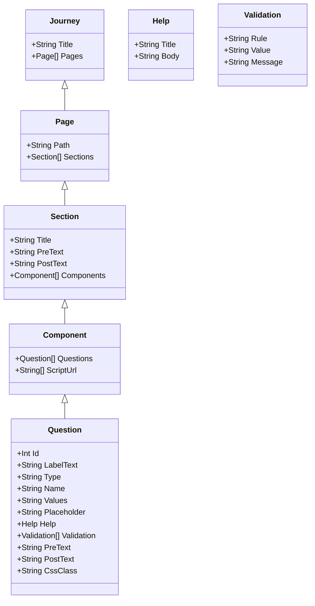

# Intro

The following is an attempt to define the structure of elements used within the application.

For simplicity, I have not defined base data types, we all know what these are.

[BaseDataType] := [String] | [Int] | [Decimal] | [Boolean]

[ChronologicalDataType] := [DateTime] | [Date] | [Time]

[StandardDataType] := [BaseDataType] | [ChronologicalDataTpe]

[CustomDataType] := [EmailAddress] | [Url] | <We can define Others in here, VRN, Postcode>

[DataType] : [StandardDataType] | [CustomData]

[Question] 
	Id := [Int]
	LabelText := [String]
	Type := [QuestionType]
	Name := [String]
	Values := [ValuesType]
	Placeholder := [String]
	Help := [HelpTextType]
	Validation := [ValidationCollection]
	PreText := [String]
	PostText := [String]
	CssClass := [String]

		
[ValuesType] 
	Minimum := [StandardDataType] (This would be a value for Int, Precision for Decimal, Length for String, Date / Time for Date/Time types) 
	Maximum := [StandardDataType] (This would be a value for Int, Precision for Decimal, Length for String, Date / Time for Date/Time types)
	Default := [StandardDataType] 

[QuestionType]  := "Radio" | "Checkbox" | "Text" | "Textbox"

[HelpTextType] 
	Title := [String]
	Body := [String]

[ValidationCollection] := [ValidationCollection], [ValidationType] | [ValidationType]

[ValidationType] 
    Rule := [ValidationRule]
    Value := [StandardDataType]
    Message := [String]

​	
[ValidationRule] := "RequiredField" | "MustBeGreaterThan" | "MustBeLessThan" | "MustMatchExpression" | <Any others we want to add into here>

[QuestionCollection]
    Questions := [QuestionCollection], [Question] | [Question]

[Component]
    Questions := [QuestionCollection]
    Script := [String]
    ?? Do we want something else here ??

[ComponentCollection]
    Components := [ComponentCollection], [Component] | [Component]

[Section]
    Title := [String]
    Pre := [String]
    Post := [String]
    Components : [ComponentCollection]

[SectionCollection]
    Section := [SectionCollection], [Section] | [Section]

[Page]
    Sections := [SectionCollection]

[PagesCollection]
    Path := [String]
    Pages := [PagesCollection], [Page] | [Page]

[Journey]
    Title := [String]
    Pages := [PagesCollection]

